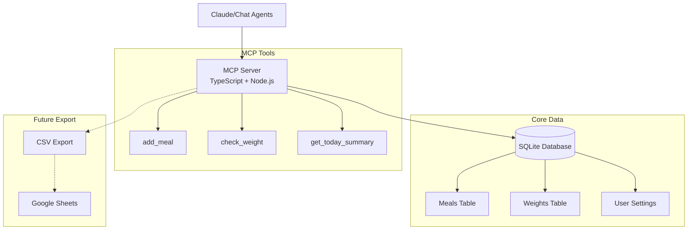

# Calorie Tracker MCP Server

## 🎯 Project Overview

A calorie tracking system designed as a first-class citizen for chat agents (like Claude), featuring MCP (Model Context Protocol) integration for seamless AI assistant interaction, persistent storage, and comprehensive analytics.

## 📋 Core Requirements

### 1. MCP Server Features
- **Remote MCP Server**: Accessible from anywhere (not just localhost)
- **Chat-First Design**: Optimized for interaction via Claude and other AI assistants
- **Simple API**: Add meals/ingredients to storage via MCP tools
- **Persistent Storage**: Database for long-term data retention

### 2. Tracking Capabilities
- **Calorie Tracking**: Log meals with calorie information
- **Weight Check-ins**: Record daily weight measurements
- **Historical Data Import**: Support CSV imports for existing data

### 3. Analytics Features
- **Daily Metrics**:
  - Total calories consumed
  - Caloric deficit/surplus
  - Weight measurements
  
- **Trend Analysis**:
  - Moving average weight (configurable N days)
  - Daily weight changes
  - Average/median weight changes over N days
  - Total weight loss over time periods
  
- **Advanced Analytics**:
  - Cumulative deficit calculation over date ranges
  - Metabolic rate estimation based on weight loss vs deficit
  - Ability to update metabolic rate from calculations
  
- **Export Options**:
  - Google Sheets integration for visualization
  - CSV export capabilities

## 🛠 Technology Stack

### Backend (MCP Server)
- **Language**: TypeScript/Node.js
  - Excellent MCP SDK support
  - Strong ecosystem for web services
  
- **MCP Transport**: 
  - **Local**: Stdio transport for Claude Desktop
  - **Remote**: Streamable HTTP (MCP protocol 2025-03-26) via Express.js
  
- **Database**: SQLite
  - Simple file-based database
  - No separate database server needed
  - Supports multi-user with session isolation
  - Easy backup (just copy the file)
  
- **MCP Integration**: @modelcontextprotocol/sdk
  - Official MCP SDK for TypeScript
  - Latest protocol support (2025-03-26)
  - Dual transport capability (stdio + HTTP)

### Local Development
- **Requirements**: Node.js, npm/yarn
- **Database**: SQLite file in project directory
- **MCP Testing**: Claude Desktop app for local testing
- **Configuration**: Environment-based configuration
  - USER_ID for stdio transport (required)
  - Optional debug middleware for HTTP testing
  - Database path and server settings
- **Build**: `npm run build` compiles TypeScript to JavaScript

### Analytics & Export
- **CSV Export**: Primary export method
- **Report Generation**: Text-based analytics reports
- **Google Sheets**: Manual import via CSV (API integration later)
- **Future Automation**: Planned analytics scheduling

## 🏗 Architecture Design

## 📊 Data Model

- **Meals**: Calories, optional macros (protein/carbs/fat), timestamps
- **Weights**: Daily weight entries with date constraints
- **User Settings**: Metabolic rate, timezone preferences

All data scoped by user_id with full multi-user support and session isolation.

## 🔧 MCP Tools

- [x] **add_meal**: Log meals with calories and optional macros
- [x] **check_weight**: Record/update daily weight entries  
- [x] **update_user_settings**: Update timezone and metabolic rate
- [x] **get_summary**: Multi-day summary with daily stats and totals in JSON format
- [ ] **list_recent_meals**: List recent meal entries
- [ ] **update_meal**: Update existing meal entries
- [ ] **delete_meal**: Delete meal entries
- [ ] **get_weight_trend**: Moving averages and analytics
- [ ] **export_csv**: Data export functionality

## 🧪 Testing

### ✅ Current Testing
- Manual testing via Claude Desktop and MCP Inspector
- Database operations validated with sample data

### 🚧 Planned Testing  
- Unit tests for database operations
- Integration tests for MCP protocol compliance

## 📚 Documentation

- **[DEVELOPMENT.md](./DEVELOPMENT.md)** - Complete guide for running and debugging both transport modes
- **[CLAUDE.md](./CLAUDE.md)** - Development guidelines and coding standards
- **[Dockerfile](./Dockerfile)** - Container deployment configuration

## ✅ Current Status

- ✅ TypeScript project with MCP SDK
- ✅ SQLite database with schema  
- ✅ Core MCP tools functional
- ✅ Dual transport support (stdio + HTTP)
- ✅ User-contextual architecture with session isolation
- ✅ Tested with Claude Desktop and MCP Inspector

## 💡 Why TypeScript?

We chose TypeScript over Go because the official MCP SDK is TypeScript-first, providing better stability, documentation, and long-term support for building MCP servers.

---

## 📋 Remaining Todo Items

### Core Features
- [x] Implement graceful shutdown with connection removals
- [ ] Test concurrent access through two different clients
- [ ] Implement CSV import functionality for historical data
- [ ] Design and implement meal presets system - brainstorm client preset discovery and usage patterns

### Analytics & Reporting
- [ ] Metabolic rate calculation from historical data
- [ ] Enhanced daily summary tool (any date)
- [ ] Weight trend analysis with moving averages
- [ ] Date range statistics tool
- [ ] Weekly/monthly summary reports
- [ ] Weight prediction models

### Testing & Quality
- [x] Set up Vitest testing framework with in-memory SQLite
- [x] Write comprehensive database layer tests
- [x] Add tests to CI/CD pipeline

### Production & Deployment
- [x] Set up CI/CD pipeline with automated testing
- [ ] Choose hosting platform and deploy
- [ ] Implement backup strategy
- [ ] Monitoring and alerting
- [ ] Security hardening
- [ ] Add proper authentication when internet-facing

### Optional Enhancements
- [ ] Web dashboard
- [ ] Google Sheets direct integration
- [ ] Mobile app considerations
- [ ] Third-party fitness app sync

---

