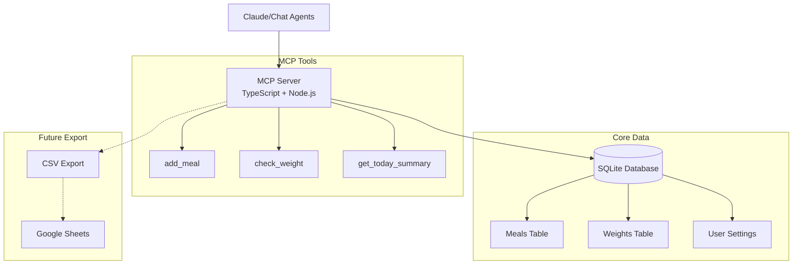

# Calorie Tracker MCP - Complete Project Plan

## 📋 Implementation Progress

### Phase 1: Minimum Viable MCP Server ✅ COMPLETED

#### Step 1: Project Setup & Basic MCP Server ✅
- [x] Initialize TypeScript project
- [x] Install MCP SDK and SQLite dependencies  
- [x] Configure TypeScript with modern settings
- [x] Set up ESLint and Prettier
- [x] Create project directory structure
- [x] Add development scripts and tooling
- [x] Create configuration system (app vs user settings)
- [x] Implement basic logging infrastructure
- [x] Create MCP server with stdio transport
- [x] Add hello tool for testing
- [x] Set up MCP Inspector for debugging

#### Step 2: Core Tools & Database ✅
- [x] Design and implement SQLite database schema
- [x] Create database initialization and migration system
- [x] Implement `add_meal` MCP tool
- [x] Implement `check_weight` MCP tool  
- [x] Implement `get_today_summary` MCP tool
- [x] Add input validation and error handling
- [x] Create database wrapper with proper transactions

#### Step 3: Testing & Local Deployment
- [x] Test with Claude Desktop configuration
- [x] Test with MCP Inspector
- [ ] Document setup process

### Phase 2: Enhanced Tracking & CRUD Operations ✅ COMPLETED

#### Remote Access Setup ✅ COMPLETED
- [x] Research and choose remote transport (SSE vs HTTP) - **Streamable HTTP selected**
- [x] Implement Streamable HTTP transport (2025-03-26 protocol) alongside stdio
- [x] Test remote access locally
- [x] Implement user identification via X-User-ID header (required, no fallback)
- [x] Create user-contextual MCP servers with session isolation
- [x] Test both HTTP and stdio transports successfully
- [ ] Document remote setup process

**Transport Decision**: Using **Streamable HTTP** (MCP protocol 2025-03-26) over legacy SSE transport because:
- Latest MCP protocol standard
- Single HTTP endpoint (simpler than SSE's dual endpoints)
- Serverless platform compatibility (Fly.io, Railway, etc.)
- Future-proof and actively maintained

**Authentication Decision**: Using **Required User ID Header** for self-hosted simplicity:
- This is a personal, self-hosted project (internet access is far future)
- **Required** `X-User-ID` header - no fallback user generation
- Each HTTP session gets isolated McpServer instance bound to the user ID
- Perfect user isolation - no data leakage between users possible
- Stdio transport uses `USER_ID` environment variable (local use only)
- Can upgrade to proper auth (OAuth/tokens) when internet-facing

### Phase 3: Analytics Foundation 🚧 NEXT

#### Basic Analytics
- [ ] brain storm what tool call we need. how many tools are required actually?
- [ ] Metabolic rate calculation from historical data
- [ ] Implement enhanced `get_daily_summary` (any date)
- [ ] Implement `get_weight_trend` with moving averages
- [ ] Implement `get_date_range_stats` for custom periods
- [ ] Weekly/monthly summary reports
- [ ] Weight prediction models
- [ ] Deficit accuracy tracking (what does this mean?)

#### High-Level Goals

#### Key Tools
- [ ] Implement `calculate_metabolic_rate`
- [ ] Implement `predict_weight_loss`
- [ ] Implement `get_analytics_report`

### Phase 5: Production Deployment

#### Deployment Tasks
- [ ] Choose hosting platform (see hosting options below)
- [ ] Set up CI/CD pipeline
- [ ] Implement backup strategy
- [ ] Monitoring and alerting
- [ ] Security hardening
- [ ] Add proper authentication (OAuth 2.1 / API keys) when internet-facing

### Phase 6: UI & Integrations

#### Future Enhancements
- [ ] Optional web dashboard
- [ ] Google Sheets direct integration
- [ ] Mobile app considerations
- [ ] Third-party fitness app sync

---

## 🎯 Project Overview

A calorie tracking system designed as a first-class citizen for chat agents (like Claude), featuring MCP (Model Context Protocol) integration for seamless AI assistant interaction, persistent storage, and comprehensive analytics.

## 📋 Core Requirements

### 1. MCP Server Features
- **Remote MCP Server**: Accessible from anywhere (not just localhost)
- **Chat-First Design**: Optimized for interaction via Claude and other AI assistants
- **Simple API**: Add meals/ingredients to storage via MCP tools
- **Persistent Storage**: Database for long-term data retention

### 2. Tracking Capabilities
- **Calorie Tracking**: Log meals with calorie information
- **Weight Check-ins**: Record daily weight measurements
- **Historical Data Import**: Support CSV imports for existing data

### 3. Analytics Features
- **Daily Metrics**:
  - Total calories consumed
  - Caloric deficit/surplus
  - Weight measurements
  
- **Trend Analysis**:
  - Moving average weight (configurable N days)
  - Daily weight changes
  - Average/median weight changes over N days
  - Total weight loss over time periods
  
- **Advanced Analytics**:
  - Cumulative deficit calculation over date ranges
  - Metabolic rate estimation based on weight loss vs deficit
  - Ability to update metabolic rate from calculations
  
- **Export Options**:
  - Google Sheets integration for visualization
  - CSV export capabilities

## 🛠 Technology Stack

### Backend (MCP Server)
- **Language**: TypeScript/Node.js
  - Excellent MCP SDK support
  - Strong ecosystem for web services
  
- **MCP Transport**: 
  - **Local**: Stdio transport for Claude Desktop
  - **Remote**: Streamable HTTP (MCP protocol 2025-03-26) via Express.js
  
- **Database**: SQLite
  - Simple file-based database
  - No separate database server needed
  - Perfect for single-user application
  - Easy backup (just copy the file)
  
- **MCP Integration**: @modelcontextprotocol/sdk
  - Official MCP SDK for TypeScript
  - Latest protocol support (2025-03-26)
  - Dual transport capability (stdio + HTTP)

### Local Development
- **Requirements**: Node.js, npm/yarn
- **Database**: SQLite file in project directory
- **MCP Testing**: Claude Desktop app for local testing
- **Hot Reload**: Nodemon for development
- **Configuration**: Simple config file for:
  - User ID (hard-coded initially)
  - Timezone setting
  - Default metabolic rate
- **Build**: `npm run build` compiles TypeScript to JavaScript

### Hosting Environment
- Multiple options to explore (see hosting options below)
- Key requirement: WebSocket support for MCP protocol

### Analytics & Export
- **CSV Export**: Primary export method
- **Report Generation**: Text-based analytics reports
- **Google Sheets**: Manual import via CSV (API integration later)
- **Scheduled Tasks**: Node-cron for automation

## 🏗 Architecture Design

## 📊 Data Model

- **Meals**: Calories, optional macros (protein/carbs/fat), timestamps
- **Weights**: Daily weight entries with date constraints
- **User Settings**: Metabolic rate, timezone preferences

All data scoped by user_id for future multi-user support.

## 🔧 MCP Tools

### ✅ Implemented
- **add_meal**: Log meals with calories and optional macros
- **check_weight**: Record/update daily weight entries  
- **get_today_summary**: View daily calorie intake and totals

### 🚧 Planned (Phase 2+)
- **list_recent_meals**, **update_meal**, **delete_meal**: CRUD operations
- **get_weight_trend**: Moving averages and analytics
- **export_csv**: Data export functionality

## 🧪 Testing

### ✅ Current Testing
- Manual testing via Claude Desktop and MCP Inspector
- Database operations validated with sample data

### 🚧 Planned Testing  
- Unit tests for database operations
- Integration tests for MCP protocol compliance

## 📚 Documentation

- **[DEVELOPMENT.md](./DEVELOPMENT.md)** - Complete guide for running and debugging both transport modes
- **[CLAUDE.md](./CLAUDE.md)** - Development guidelines and coding standards
- **[Dockerfile](./Dockerfile)** - Container deployment configuration

## ✅ Current Status

- ✅ TypeScript project with MCP SDK
- ✅ SQLite database with schema  
- ✅ Core MCP tools functional
- ✅ Dual transport support (stdio + HTTP)
- ✅ User-contextual architecture with session isolation
- ✅ Tested with Claude Desktop and MCP Inspector

## 💡 Why TypeScript?

We chose TypeScript over Go because the official MCP SDK is TypeScript-first, providing better stability, documentation, and long-term support for building MCP servers.

## ✅ Decisions

1. **Multi-user support**: Yes, but simplified
   - Hard-code user ID in MCP server config initially
   - Data model supports user_id from the start
   - No user management/auth system needed initially
   
2. **Food database**: Defer to later
   - Could be implemented as another MCP tool later
   - Focus on manual entry first
   
3. **Timezone handling**: Hard-code in config
   - Set timezone in MCP server configuration
   - Use for all date/time operations
   - Can enhance later if needed
   
4. **Backup strategy**: Manual for now
   - SQLite file can be copied manually
   - Automated backups can come later
   
5. **Google Sheets integration**: Start simple
   - Initial version: CSV export only
   - Users can manually import to Sheets
   - Direct Sheets API integration in later phase

---

## 🌐 Hosting Options

The MCP server needs to be accessible from anywhere (not just localhost) to work with Claude and other chat agents. Key requirements:
- WebSocket support for MCP protocol
- HTTPS for secure connections
- Persistent storage for SQLite database
- Reasonable uptime for personal use

### Option 1: Home Server

**Pros:**
- Complete control over hardware and software
- No monthly hosting fees
- Data stays on your own hardware
- Can use existing computer/Raspberry Pi

**Cons:**
- Need to handle dynamic IP or get static IP
- Security concerns with exposing home network
- Uptime depends on home internet/power
- Need to manage SSL certificates

**Setup Requirements:**
1. **Dynamic DNS Service** (DuckDNS, No-IP)
   - Maps dynamic home IP to stable domain
   - Free options available
   
2. **Port Forwarding**
   - Forward port 443 (HTTPS) to server
   - Configure router firewall rules
   
3. **Reverse Proxy** (Nginx/Caddy)
   - Handle SSL termination
   - WebSocket proxy support
   - Automatic Let's Encrypt certificates
   
4. **Security Hardening**
   - Fail2ban for brute force protection
   - API key authentication
   - Firewall rules
   - Regular security updates

**Example Setup with Tailscale:**
- Use Tailscale for secure access without port forwarding
- Access server via Tailscale network from anywhere
- No public internet exposure
- Built-in encryption

### Option 2: VPS (Virtual Private Server)

**Providers:**
- **DigitalOcean**: $4-6/month droplets
- **Linode**: Similar pricing to DO
- **Hetzner**: EU-based, very competitive pricing
- **Vultr**: Good global coverage

**Pros:**
- Full control over environment
- Static IP included
- Professional uptime
- Can host multiple services

**Cons:**
- Monthly cost
- Need to manage server security
- Responsible for backups
- More complex setup

### Option 3: Platform-as-a-Service

**Free/Low-Cost Options:**

**Fly.io**
- Free tier with 3 shared VMs
- Built-in SSL
- Good for small apps
- Persistent volumes for SQLite

**Railway**
- Simple deployment
- Free trial credits
- WebSocket support
- Volume storage available

**Render**
- Free tier available
- Automatic SSL
- Persistent disks (paid)
- Good DX

**Pros:**
- Managed infrastructure
- Automatic SSL
- Easy deployment from GitHub
- Built-in monitoring

**Cons:**
- Less control
- Potential cold starts on free tiers
- Storage costs extra
- Vendor lock-in

### Option 4: Serverless + Cloud Storage

**Architecture:**
- AWS Lambda/Vercel Functions for API
- AWS RDS/PlanetScale for database
- WebSocket via AWS API Gateway

**Pros:**
- Scales to zero
- Pay per use
- High availability

**Cons:**
- Complex MCP WebSocket handling
- Higher latency
- More expensive at scale
- Not ideal for SQLite

### Option 5: Container Hosting

**Google Cloud Run**
- Serverless containers
- Scales to zero
- Persistent storage via Cloud SQL

**AWS App Runner**
- Similar to Cloud Run
- Automatic scaling
- Container-based

### Recommendation for Your Use Case

Given the requirements:
1. **For Simplicity**: Start with Fly.io or Railway
   - Easy deployment
   - Free tier sufficient for personal use
   - SQLite-friendly with persistent volumes
   
2. **For Control**: Home server with Tailscale
   - No ongoing costs
   - Complete privacy
   - Easy setup with Tailscale

3. **For Reliability**: Small VPS ($5/month)
   - Professional uptime
   - Full control
   - Can grow with needs

### Quick Start Path

1. **Local Development First**
   - Get everything working locally
   - Test with Claude Desktop
   
2. **Tailscale for Remote Access**
   - Install Tailscale on dev machine
   - Access from anywhere securely
   - No port forwarding needed
   
3. **Deploy to Fly.io**
   - When ready for "production"
   - Simple deployment
   - Minimal configuration

### Security Considerations

Regardless of hosting choice:
- Always use HTTPS
- Implement API key authentication
- Regular backups of SQLite database
- Monitor access logs
- Keep dependencies updated

---

This plan addresses all requirements from the original prompt:
- ✅ MCP integration for Claude interaction
- ✅ Remote MCP server architecture
- ✅ Meal and weight tracking
- ✅ Persistent storage
- ✅ Google Sheets export
- ✅ Comprehensive analytics (deficit, moving averages, metabolic rate)
- ✅ CSV import capabilities
- ✅ Date range selections
- ✅ Staged development approach