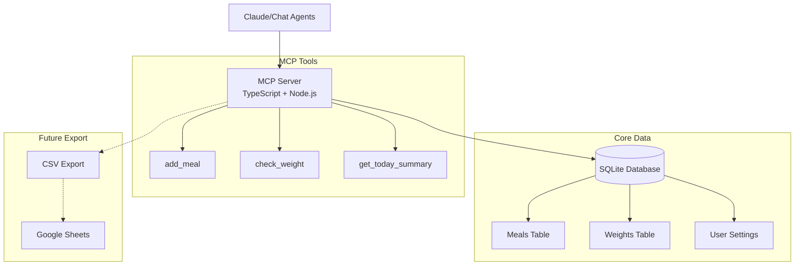

# Calorie Tracker MCP - Complete Project Plan

## 📋 Implementation Progress

### Phase 1: Minimum Viable MCP Server ✅ COMPLETED

#### Step 1: Project Setup & Basic MCP Server ✅
- [x] Initialize TypeScript project
- [x] Install MCP SDK and SQLite dependencies  
- [x] Configure TypeScript with modern settings
- [x] Set up ESLint and Prettier
- [x] Create project directory structure
- [x] Add development scripts and tooling
- [x] Create configuration system (app vs user settings)
- [x] Implement basic logging infrastructure
- [x] Create MCP server with stdio transport
- [x] Add hello tool for testing
- [x] Set up MCP Inspector for debugging

#### Step 2: Core Tools & Database ✅
- [x] Design and implement SQLite database schema
- [x] Create database initialization and migration system
- [x] Implement `add_meal` MCP tool
- [x] Implement `check_weight` MCP tool  
- [x] Implement `get_today_summary` MCP tool
- [x] Add input validation and error handling
- [x] Create database wrapper with proper transactions

#### Step 3: Testing & Local Deployment
- [x] Test with Claude Desktop configuration
- [x] Test with MCP Inspector
- [ ] Document setup process

### Phase 2: Enhanced Tracking & CRUD Operations ✅ COMPLETED

#### Remote Access Setup ✅ COMPLETED
- [x] Research and choose remote transport (SSE vs HTTP) - **Streamable HTTP selected**
- [x] Implement Streamable HTTP transport (2025-03-26 protocol) alongside stdio
- [x] Test remote access locally
- [x] Implement user identification via X-User-ID header (required, no fallback)
- [x] Create user-contextual MCP servers with session isolation
- [x] Test both HTTP and stdio transports successfully
- [x] Add debug middleware for MCP Inspector HTTP testing
- [x] Document comprehensive development and debugging guide

---

## 🎯 Project Overview

A calorie tracking system designed as a first-class citizen for chat agents (like Claude), featuring MCP (Model Context Protocol) integration for seamless AI assistant interaction, persistent storage, and comprehensive analytics.

## 📋 Core Requirements

### 1. MCP Server Features
- **Remote MCP Server**: Accessible from anywhere (not just localhost)
- **Chat-First Design**: Optimized for interaction via Claude and other AI assistants
- **Simple API**: Add meals/ingredients to storage via MCP tools
- **Persistent Storage**: Database for long-term data retention

### 2. Tracking Capabilities
- **Calorie Tracking**: Log meals with calorie information
- **Weight Check-ins**: Record daily weight measurements
- **Historical Data Import**: Support CSV imports for existing data

### 3. Analytics Features
- **Daily Metrics**:
  - Total calories consumed
  - Caloric deficit/surplus
  - Weight measurements
  
- **Trend Analysis**:
  - Moving average weight (configurable N days)
  - Daily weight changes
  - Average/median weight changes over N days
  - Total weight loss over time periods
  
- **Advanced Analytics**:
  - Cumulative deficit calculation over date ranges
  - Metabolic rate estimation based on weight loss vs deficit
  - Ability to update metabolic rate from calculations
  
- **Export Options**:
  - Google Sheets integration for visualization
  - CSV export capabilities

## 🛠 Technology Stack

### Backend (MCP Server)
- **Language**: TypeScript/Node.js
  - Excellent MCP SDK support
  - Strong ecosystem for web services
  
- **MCP Transport**: 
  - **Local**: Stdio transport for Claude Desktop
  - **Remote**: Streamable HTTP (MCP protocol 2025-03-26) via Express.js
  
- **Database**: SQLite
  - Simple file-based database
  - No separate database server needed
  - Perfect for single-user application
  - Easy backup (just copy the file)
  
- **MCP Integration**: @modelcontextprotocol/sdk
  - Official MCP SDK for TypeScript
  - Latest protocol support (2025-03-26)
  - Dual transport capability (stdio + HTTP)

### Local Development
- **Requirements**: Node.js, npm/yarn
- **Database**: SQLite file in project directory
- **MCP Testing**: Claude Desktop app for local testing
- **Hot Reload**: Nodemon for development
- **Configuration**: Simple config file for:
  - User ID (hard-coded initially)
  - Timezone setting
  - Default metabolic rate
- **Build**: `npm run build` compiles TypeScript to JavaScript

### Hosting Environment
- Multiple options to explore (see hosting options below)
- Key requirement: WebSocket support for MCP protocol

### Analytics & Export
- **CSV Export**: Primary export method
- **Report Generation**: Text-based analytics reports
- **Google Sheets**: Manual import via CSV (API integration later)
- **Scheduled Tasks**: Node-cron for automation

## 🏗 Architecture Design

## 📊 Data Model

- **Meals**: Calories, optional macros (protein/carbs/fat), timestamps
- **Weights**: Daily weight entries with date constraints
- **User Settings**: Metabolic rate, timezone preferences

All data scoped by user_id for future multi-user support.

## 🔧 MCP Tools

- [x] **add_meal**: Log meals with calories and optional macros
- [x] **check_weight**: Record/update daily weight entries  
- [x] **get_today_summary**: View daily calorie intake and totals
- [ ] **list_recent_meals**: List recent meal entries
- [ ] **update_meal**: Update existing meal entries
- [ ] **delete_meal**: Delete meal entries
- [ ] **get_weight_trend**: Moving averages and analytics
- [ ] **export_csv**: Data export functionality

## 🧪 Testing

### ✅ Current Testing
- Manual testing via Claude Desktop and MCP Inspector
- Database operations validated with sample data

### 🚧 Planned Testing  
- Unit tests for database operations
- Integration tests for MCP protocol compliance

## 📚 Documentation

- **[DEVELOPMENT.md](./DEVELOPMENT.md)** - Complete guide for running and debugging both transport modes
- **[CLAUDE.md](./CLAUDE.md)** - Development guidelines and coding standards
- **[Dockerfile](./Dockerfile)** - Container deployment configuration

## ✅ Current Status

- ✅ TypeScript project with MCP SDK
- ✅ SQLite database with schema  
- ✅ Core MCP tools functional
- ✅ Dual transport support (stdio + HTTP)
- ✅ User-contextual architecture with session isolation
- ✅ Tested with Claude Desktop and MCP Inspector

## 💡 Why TypeScript?

We chose TypeScript over Go because the official MCP SDK is TypeScript-first, providing better stability, documentation, and long-term support for building MCP servers.

## ✅ Decisions

1. **Multi-user support**: Yes, but simplified
   - Hard-code user ID in MCP server config initially
   - Data model supports user_id from the start
   - No user management/auth system needed initially
   
2. **Food database**: Defer to later
   - Could be implemented as another MCP tool later
   - Focus on manual entry first
   
3. **Timezone handling**: Hard-code in config
   - Set timezone in MCP server configuration
   - Use for all date/time operations
   - Can enhance later if needed
   
4. **Backup strategy**: Manual for now
   - SQLite file can be copied manually
   - Automated backups can come later
   
5. **Google Sheets integration**: Start simple
   - Initial version: CSV export only
   - Users can manually import to Sheets
   - Direct Sheets API integration in later phase

---

## 📋 Remaining Todo Items

### Core Features
- [ ] Implement graceful shutdown with connection removals
- [ ] Test concurrent access through two different clients
- [ ] Implement CSV import functionality for historical data

### Analytics & Reporting
- [ ] Metabolic rate calculation from historical data
- [ ] Enhanced daily summary tool (any date)
- [ ] Weight trend analysis with moving averages
- [ ] Date range statistics tool
- [ ] Weekly/monthly summary reports
- [ ] Weight prediction models

### Production & Deployment
- [ ] Choose hosting platform and deploy
- [ ] Set up CI/CD pipeline
- [ ] Implement backup strategy
- [ ] Monitoring and alerting
- [ ] Security hardening
- [ ] Add proper authentication when internet-facing

### Optional Enhancements
- [ ] Web dashboard
- [ ] Google Sheets direct integration
- [ ] Mobile app considerations
- [ ] Third-party fitness app sync

---

